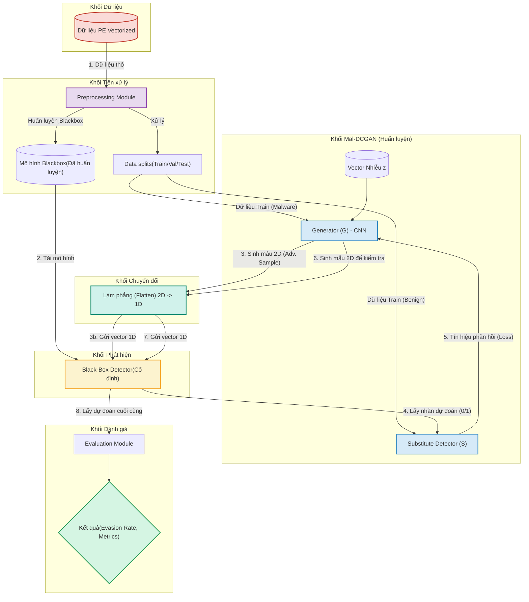

```mermaid
graph TD
    %% === Định nghĩa các khối (Đã tinh gọn) ===
    subgraph A["Khối Dữ liệu"]
        A_Data[("Dữ liệu PE Vectorized")]
    end

    subgraph B["Khối Tiền xử lý"]
        direction LR
        B_Pre["Preprocessing Module"]
        B_Out_Data["Data splits(Train/Val/Test)"]
        B_Out_Model[("Mô hình Blackbox(Đã huấn luyện)")]
        B_Pre -->|"Xử lý"| B_Out_Data
        B_Pre -->|"Huấn luyện Blackbox"| B_Out_Model
    end

    subgraph F["Khối Chuyển đổi"]
        F_Flatten["Làm phẳng (Flatten) 2D -> 1D"]
    end

    subgraph C["Khối Phát hiện"]
        C_BB["Black-Box Detector(Cố định)"]
    end

    subgraph D["Khối Mal-DCGAN (Huấn luyện)"]
        D_G["Generator (G) - CNN"]
        D_S["Substitute Detector (S)"]
        D_z[("Vector Nhiễu z")]
    end

    subgraph E["Khối Đánh giá"]
        E_Eval["Evaluation Module"]
        E_Result{"Kết quả(Evasion Rate, Metrics)"}
        E_Eval --> E_Result
    end

    %% === Luồng 1: Chuẩn bị ===
    A_Data -->|"1. Dữ liệu thô"| B_Pre
    B_Out_Model -->|"2. Tải mô hình"| C_BB

    %% === Luồng 2: Vòng lặp Huấn luyện Mal-DCGAN ===
    B_Out_Data -- "Dữ liệu Train (Malware)" --> D_G
    B_Out_Data -- "Dữ liệu Train (Benign)" --> D_S
    D_z --> D_G

    %% Luồng lấy nhãn cho S
    D_G -->|"3. Sinh mẫu 2D (Adv. Sample)"| F_Flatten
    F_Flatten -->|"3b. Gửi vector 1D"| C_BB
    C_BB -->|"4. Lấy nhãn dự đoán (0/1)"| D_S

    %% Luồng huấn luyện G
    D_S -->|"5. Tín hiệu phản hồi (Loss)"| D_G

    %% === Luồng 3: Đánh giá ===
    D_G -->|"6. Sinh mẫu 2D để kiểm tra"| F_Flatten
    F_Flatten -->|"7. Gửi vector 1D"| C_BB
    C_BB -->|"8. Lấy dự đoán cuối cùng"| E_Eval

    %% === Styling (Giữ nguyên) ===
    style A_Data fill:#FADBD8,stroke:#C0392B,stroke-width:2px
    style B_Pre fill:#E8DAEF,stroke:#8E44AD,stroke-width:2px
    style C_BB fill:#FCF3CF,stroke:#F39C12,stroke-width:2px
    style D_G fill:#D6EAF8,stroke:#2E86C1,stroke-width:2px
    style D_S fill:#D6EAF8,stroke:#2E86C1,stroke-width:2px
    style E_Result fill:#D5F5E3,stroke:#229954,stroke-width:2px
    style F_Flatten fill:#D1F2EB,stroke:#138D75,stroke-width:2px
```
